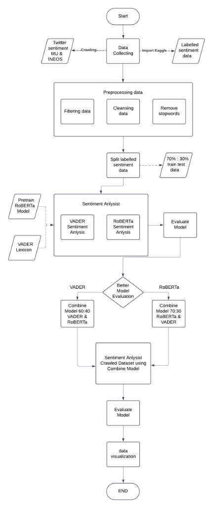
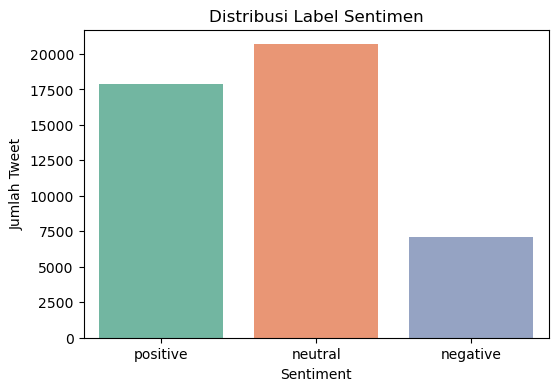
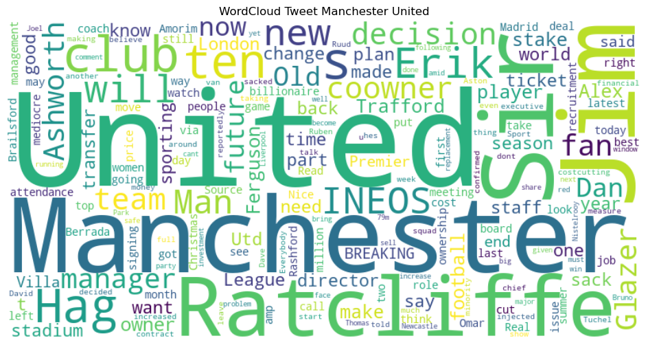
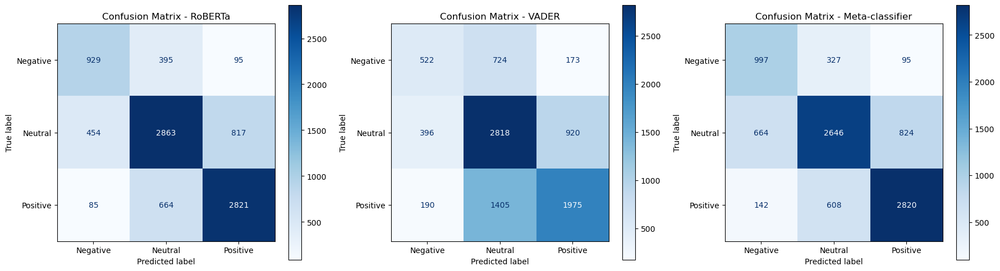
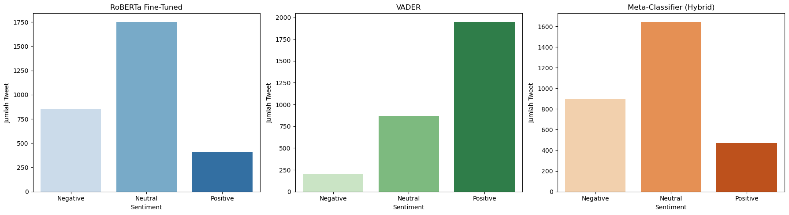

# Public Sentiment Analysis of Manchester United on X/Twitter
> **Bachelor's Thesis Project (Skripsi)**  
> **Author:** Farhan Fathurroziq | Informatics Graduate  
> **Institution:** Universitas AMIKOM Yogyakarta  

[](https://www.python.org/)
[](https://pytorch.org/)
[](https://huggingface.co/)
[](https://www.nltk.org/)
[](https://scikit-learn.org/)
[](https://github.com/helmisatria/tweet-harvest)

---

## 📌 Project Overview
This repository contains the codebase and publications for a Bachelor's Thesis analyzing public sentiment on X (formerly Twitter) regarding **Manchester United**. The study focuses on public reactions during the **INEOS/Sir Jim Ratcliffe** acquisition period (December 2023 - December 2024). 

By comparing traditional lexicon-based methods with state-of-the-art Deep Learning models and ensembling techniques, this project presents a comprehensive workflow for social media sentiment classification.

### 🌟 Key Features
- **Data Scraping:** Automated extraction of tweets utilizing the `Tweet-Harvest` CLI.
- **Lexicon-Based Baseline:** Threshold-optimized **VADER Sentiment Analysis**.
- **Transformer Fine-Tuning:** Fine-tuned **RoBERTa-base** classifier.
- **Class Balancing:** Comparison of **Random Over-Sampling (ROS)** and **Random Under-Sampling (RUS)** techniques.
- **Stacking Ensemble:** A **Meta-Classifier** stacking pipeline combining predictions from RoBERTa and VADER to improve overall generalization and balance across positive, neutral, and negative classes.

---

## 📋 Research Flow (Alur Penelitian)
Below is the research methodology flowchart mapping the data collection, preprocessing, model training, evaluation, and ensembling stages of this thesis:

<p align="center">
  
</p>

---

## 📂 Repository Structure
```text
├── assets/
│   └── images/                     # Extracted result plots & charts
├── data/
│   └── MU_public_sentiment.csv     # Scraped raw dataset (~2,000+ tweets)
├── docs/
│   ├── Publikasi 21.61.0213 Farhan Fathurroziq.pdf   # Publication Paper (PDF)
│   └── Skripsi 21610213 Farhan Fathurroziq.pdf       # Full Thesis Report (PDF)
├── notebooks/
│   ├── Scrapping_skripsi.ipynb     # Twitter data scraping notebook
│   └── Skripsi.ipynb               # EDA, data balancing, modeling, and evaluation
├── .gitignore                      # Git ignore file for temp & evaluation outputs
├── README.md                       # Main documentation (this file)
└── requirements.txt                # Python dependencies
```

---

## 📊 Dataset & Exploratory Data Analysis (EDA)
Data was scraped using the following parameters:
*   **Search Query:** `Manchester United or mufc or mu or Man United or ManUtd and ineos or Jim Ratcliffe or sir jim`
*   **Date Range:** `2023-12-25` to `2024-12-25`
*   **Language:** English

### Sentiment Distribution
The dataset exhibits a natural class imbalance, with a predominant volume of Neutral and Positive tweets compared to Negative ones.

| Sentiment Class | Count |
| :--- | :---: |
| Negative | 1,419 |
| Neutral | 4,134 |
| Positive | 3,570 |
| **Total** | **9,123** |

<p align="center">
  
</p>

### WordCloud Visualizations
The overall word cloud highlights key topics such as *Sir Jim Ratcliffe*, *INEOS*, *Glazers*, *Ten Hag*, and *Old Trafford*.
<p align="center">
  
</p>

---

## ⚙️ Modeling & Pipeline
The project implements and compares three main classification approaches:

1.  **VADER Sentiment (Lexicon-Based):** 
    - Rule-based classification optimized by searching for compound score thresholds that maximize the weighted F1-score.
    - **Optimized Thresholds:** Positive compound $\ge 0.41$, Negative compound $\le -0.41$.
2.  **RoBERTa Fine-Tuned (Deep Learning):**
    - A pretrained `roberta-base` model fine-tuned using Hugging Face's `Trainer`.
    - Evaluated on three data variations: Original (Imbalanced), Over-sampled (ROS), and Under-sampled (RUS).
3.  **Meta-Classifier Stacking (Ensemble):**
    - Combines the raw probability outputs/predictions from the fine-tuned RoBERTa model and the VADER compound scores.
    - Trains a meta-classifier (**Logistic Regression**) on top of these features to generate the final prediction.

---

## Key Findings

- Neutral sentiment dominated the discussion around INEOS ownership.
- RoBERTa outperformed VADER by more than 13 percentage points in F1-score.
- Oversampling did not significantly improve model performance.
- The stacking ensemble produced a more balanced class prediction profile.

## 📈 Evaluation Results
Below is the performance comparison across the models evaluated on the test set:

| Model Approach | Balancing Method | Test Accuracy | Weighted F1-Score |
| :--- | :--- | :---: | :---: |
| **VADER (Optimized Threshold)** | Threshold Optimization | 59.00% | 58.77% |
| **RoBERTa (Model A)** | None (Original) | **72.49%** | **72.45%** |
| **RoBERTa (Model B)** | ROS (Oversampling) | 71.82% | 71.86% |
| **RoBERTa (Model C)** | RUS (Undersampling) | 69.10% | 69.26% |
| **Meta-Classifier (Stacking)** | RoBERTa + VADER Ensemble | **70.52%** | **70.63%** |

> ℹ️ *Note: The Stacking Meta-Classifier is evaluated on a dedicated stacking test set ($N=2,737$), and demonstrates the most balanced recall and precision profile across all three sentiment classes (reducing the False Positive bias of RoBERTa on Neutrals and VADER's bias towards Netrality).*

### Confusion Matrix Comparisons
Comparing the error profiles of RoBERTa, VADER, and the Meta-Classifier:
<p align="center">
  
</p>

### Classified Sentiments Distribution
Below is the comparison of predicted sentiment distributions across the test set:
<p align="center">
  
</p>

---

## 🚀 How to Run Locally

### 1. Clone the Repository
```bash
git clone https://github.com/your-username/your-repo-name.git
cd your-repo-name
```

### 2. Setup Virtual Environment
It is recommended to use a virtual environment (`conda` or `venv` with Python 3.10+):
```bash
# Using venv
python -m venv venv
source venv/Scripts/activate  # On Windows: venv\Scripts\activate

# Using conda
conda create -n mu-sentiment python=3.10 -y
conda activate mu-sentiment
```

### 3. Install Dependencies
```bash
pip install -r requirements.txt
```

### 4. Running the Notebooks
To run the notebooks, start Jupyter Lab or Jupyter Notebook:
```bash
jupyter notebook
```
- Open `notebooks/Skripsi.ipynb` to view the Exploratory Data Analysis, class balancing steps, model training, stacking ensemble implementation, and results validation.
- Open `notebooks/Scrapping_skripsi.ipynb` to see how Twitter data scraping was performed via `Tweet-Harvest`. Note that running scraping requires a valid Twitter Auth Token.

---

## 📖 Thesis Publications
For in-depth explanations of the methodology, theoretical background, and exhaustive analysis, please refer to the following documents inside the [docs/](docs) directory:
- **Full Thesis Report:** [`docs/Skripsi 21610213 Farhan Fathurroziq.pdf`](docs/Skripsi%2021610213%20Farhan%20Fathurroziq.pdf)
- **Publication Article:** [`docs/Publikasi 21.61.0213 Farhan Fathurroziq.pdf`](docs/Publikasi%2021.61.0213%20Farhan%20Fathurroziq.pdf)

---

## 💡 Recommendations for Future Work
*Since this project was submitted for a Bachelor's Thesis, the core code remains frozen. However, for future research or development, the following improvements are highly recommended:*

1. **Leveraging Larger Language Models (LLMs):**  
   Replace `roberta-base` with larger architectures or generative instruction-tuned models (e.g., LLaMA-3-8B, Mistral-7B, or Gemini API via few-shot prompting). This could significantly boost performance, particularly in understanding context-rich sarcasm common in sports tweets.
2. **Real-time Pipeline Integration:**  
   Transition from a batch-scraping workflow to a real-time streaming pipeline. Deploy a scraper running on a cron schedule or use a streaming platform (such as Apache Kafka) combined with a live dashboard built in **Streamlit** or **Dash** to monitor fan sentiment dynamically.
3. **Advanced Stacking Classifiers:**  
   Replace the Logistic Regression meta-classifier with a non-linear classifier such as **XGBoost**, **LightGBM**, or a small neural network to capture non-linear relationships between RoBERTa's predictions and VADER's compound scores.
4. **Enhanced Data Preprocessing for Sports Jargon:**  
   Incorporate custom normalization dictionaries to map soccer-specific slang, abbreviation terms, and transfer window idioms (e.g., *"Here We Go"*, *"GlazersOut"*, *"ETH"*, *"SJR"*) to their semantic equivalents to improve the sentiment lexicon resolution.
